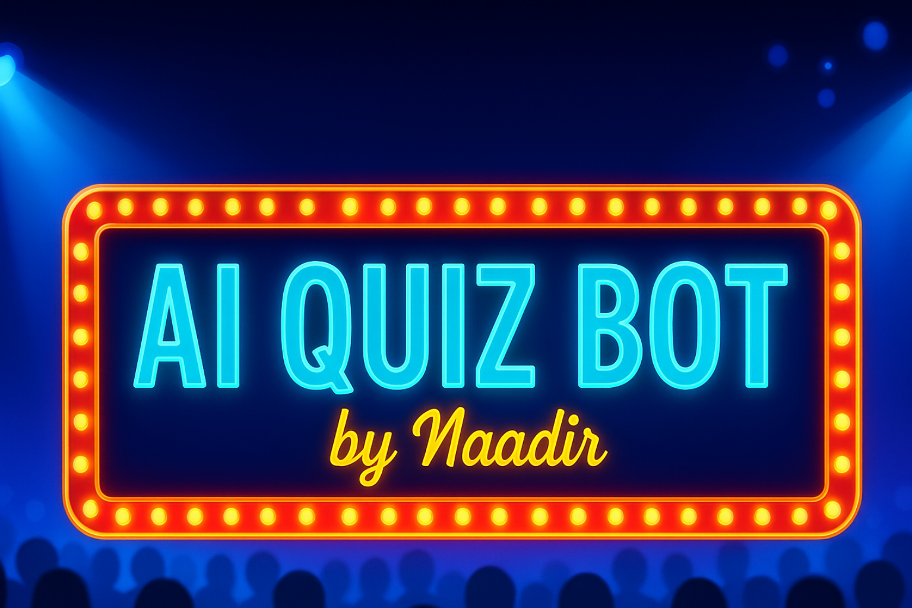

# AI Quiz Bot

AI Quiz Bot is a gamified quiz platform built with [Streamlit](https://streamlit.io/) and Google’s Gemini 1.5-Flash model. It lets you challenge yourself (or compete against the AI!) on any topic, at three difficulty levels, with instant AI-generated feedback and a game-show style interface.



---

**Author**: Naadir  
**Year**: 2025  


## Features

- **Dynamic Quiz Generation**  
  Generate 1–30 questions on *any* topic at **Easy / Medium / Hard** difficulty.

- **AI-Graded Answers**  
  Answers are sent to Gemini 1.5-Flash for correctness checks and friendly feedback.

- **Gamified UI**  
  - Retro-futuristic, game-show styling via custom CSS  
  - Real-time scoreboard (“You vs. AI”)  
  - Celebration animations on wins

- **Customization**  
  - Swap in your own banner (`images/banner.png`)  
  - Tweak colors, fonts, and layout in the injected CSS

- **Secure Secrets**  
  Streamlit’s secrets management keeps your Gemini key out of version control.

---

## Tech Stack

- **Python 3.8+**  
- **[Streamlit](https://streamlit.io/)** for UI  
- **google-generativeai** SDK for Gemini API  
- **Custom CSS** for theming  
- **Git & GitHub** for version control  
- **Streamlit Community Cloud** for deployment

--


## Usage

1. **Sidebar Controls**  
   - **Topic**: e.g. “Basic Astronomy”  
   - **Difficulty**: Easy / Medium / Hard  
   - **Number of Questions**: 1–30  
   - Click **Generate Quiz**

2. **Answering Questions**  
   - Enter your answer  
   - Click **Submit & Next ▶️**  
   - See instant AI feedback and updated scores

3. **Quiz Complete**  
   - View final scores  
   - Click **Take Another Quiz** to restart

---


## roject Structure

```
AIQuizBot/
├── .gitignore
├── README.md
├── main.py
├── requirements.txt
├── images/
│   ├── banner.png
│   └── .gitkeep
└── .streamlit/
    ├── secrets.example.toml
    └── secrets.toml       # Ignored by Git
```

---


