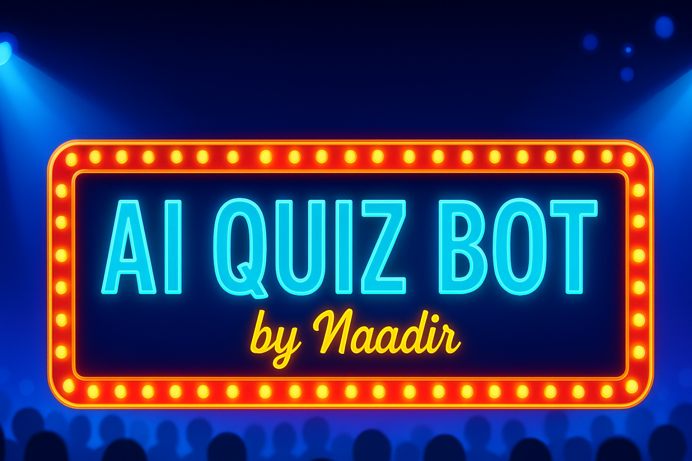

# AI Quiz Bot

> Gamified quiz platform powered by Google Gemini AI with dynamic question generation and real-time grading.

[](https://www.python.org/)
[](https://streamlit.io/)
[](https://ai.google.dev/)

---

## Overview

AI Quiz Bot is a gamified quiz platform built with Streamlit and Google's Gemini 1.5-Flash model. It lets you challenge yourself on any topic at three difficulty levels with instant AI generated feedback and a game show style interface. Generate custom quizzes with 1-30 questions, receive intelligent grading and educational feedback, and track your performance against the AI.

The application features a retro futuristic dark themed interface, real-time scoring, custom CSS styling, and secure API key management through Streamlit Secrets.

---

## Features

- Dynamic quiz generation on any topic
- Three difficulty levels: Easy, Medium, Hard
- Generate 1-30 questions per quiz
- AI graded answers with instant feedback
- Real-time scoreboard: You vs. AI
- Celebration animations on correct answers
- Customizable banner and UI theming
- Secure API key management via Streamlit Secrets
- Question persistence across sessions
- Responsive mobile and desktop design
- Game show style retro futuristic interface

---

## Screenshots

> Drop screenshots into `screens/` or the root and they'll render here.



---

## Getting Started

### Prerequisites

- Python 3.8 or higher
- Google Gemini API key
- Streamlit Community Cloud account (for deployment)

### Installation

```bash
git clone https://github.com/Naadir-Dev-Portfolio/Streamlit-AIQuizbot.git
cd Streamlit-AIQuizbot
pip install -r requirements.txt
```

### Configuration

1. Get a Gemini API key from [Google AI Studio](https://aistudio.google.com/)
2. Create `.streamlit/secrets.toml`:

```toml
gemini_api_key = "YOUR_GEMINI_API_KEY_HERE"
```

### Run Locally

```bash
streamlit run main.py
```

### Deploy to Streamlit Cloud

1. Push to GitHub
2. Go to [Streamlit Community Cloud](https://share.streamlit.io/)
3. Deploy directly from your repo
4. Add your Gemini API key to the Streamlit Secrets

---

## Tech Stack

- Python 3.8+, Core application
- Streamlit, Web UI framework
- google generativeai, Gemini API SDK
- Custom CSS, Game show themed styling
- Streamlit Cloud, Deployment platform
- Git/GitHub, Version control

---

## How It Works

1. Select a topic and difficulty level
2. Choose how many questions (1-30)
3. Click "Generate Quiz" to create questions
4. Answer each question in the input field
5. Submit and receive instant AI feedback
6. Watch your score update in real-time
7. See how you stack up against the AI
8. Take another quiz to practice more

---

## Features Breakdown

- **Dynamic Generation**: Gemini creates unique questions tailored to your topic and difficulty
- **Intelligent Grading**: AI evaluates answers for correctness and understanding
- **Educational Feedback**: Receive explanations and hints
- **Gamification**: Points, streak counters, and celebration animations
- **Customization**: Easy to modify colors, fonts, and UI elements

---

## Related Projects

- [Streamlit ccmi genai](https://github.com/Naadir Dev Portfolio/Streamlit ccmi genai)
- [Website ccmi team site](https://github.com/Naadir Dev Portfolio/Website ccmi team site)
